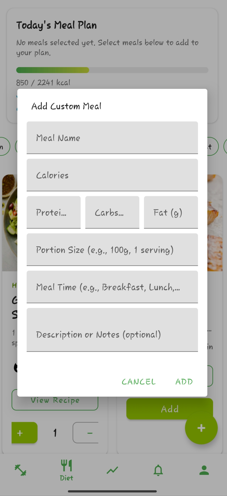
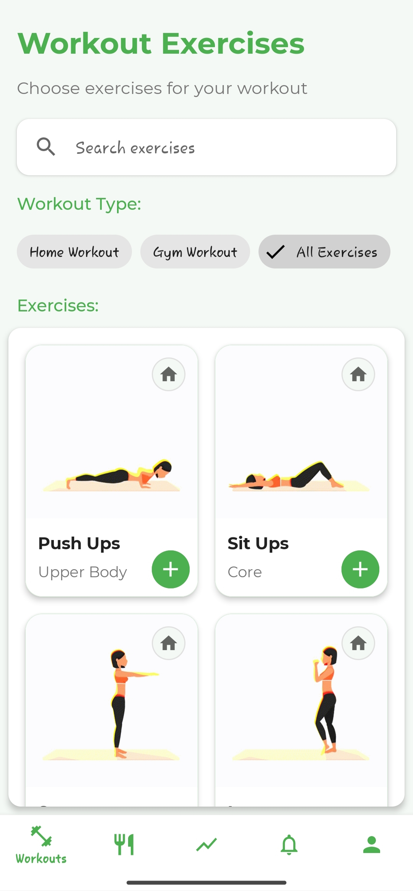
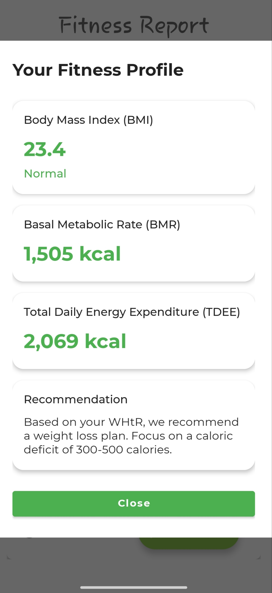
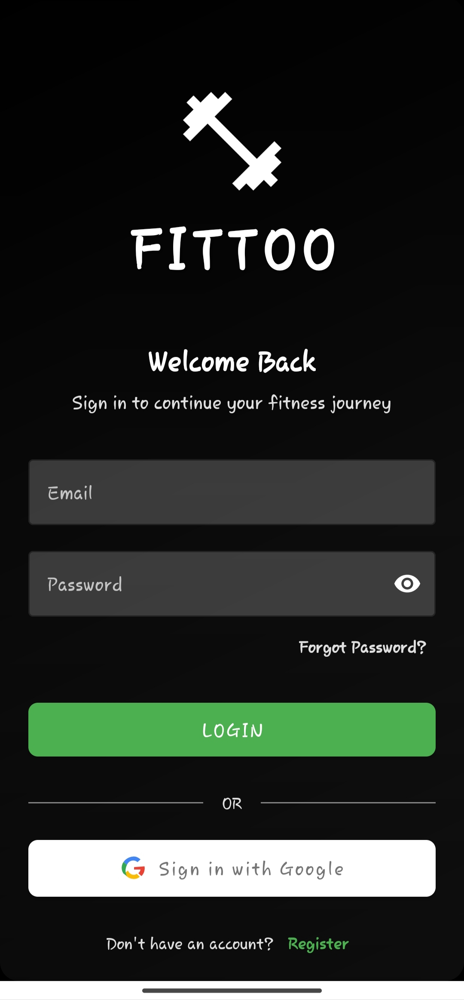
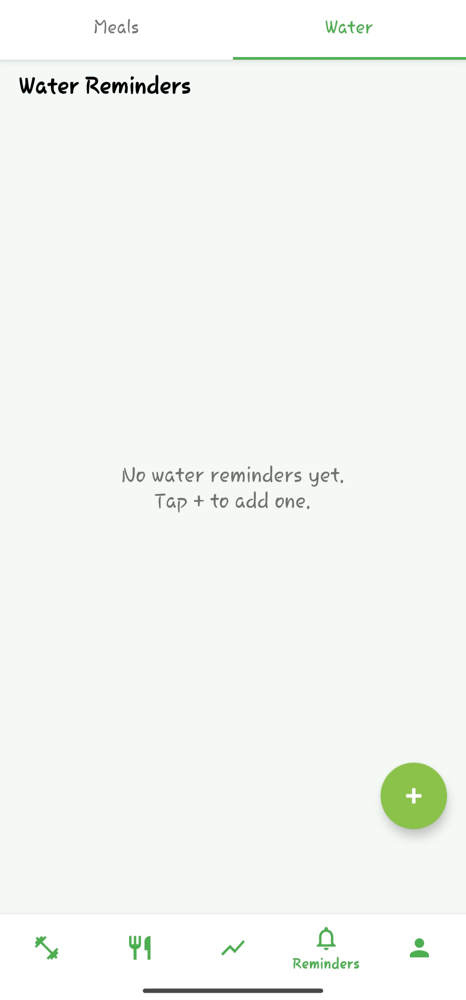
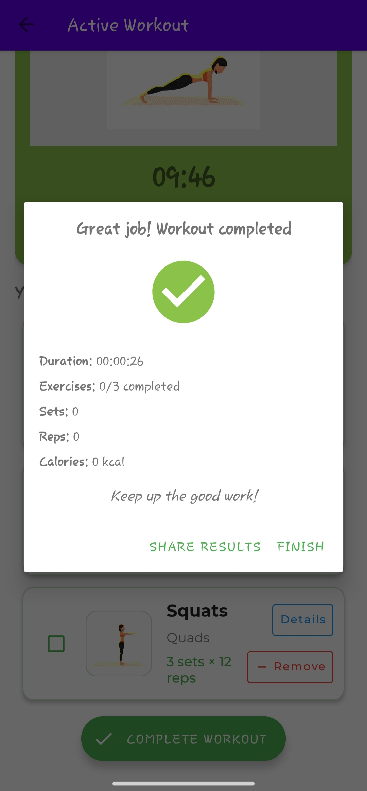
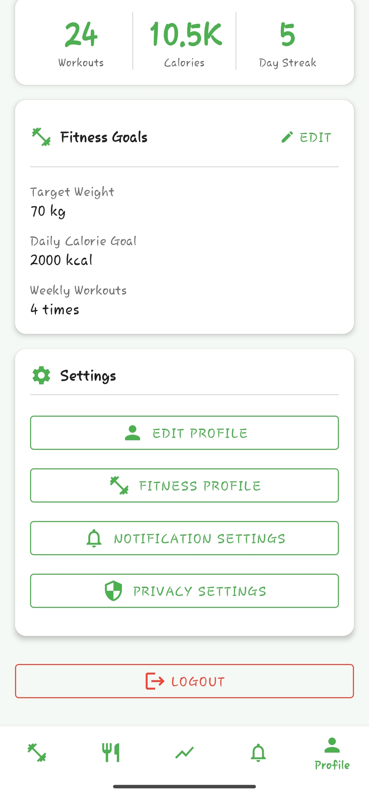
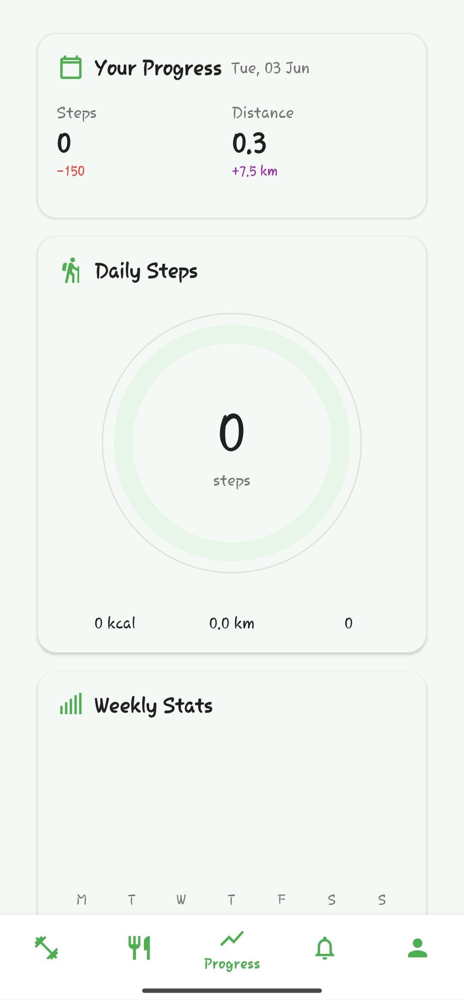
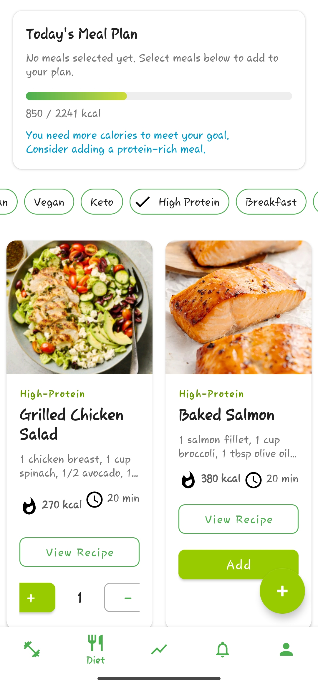

💪 Fittoo – Personal Fitness & Wellness App

Fittoo is an all-in-one Android app built to help users take control of their fitness journey. It offers custom workout plans, personalized diet tracking, and real-time progress monitoring—all in a smooth and intuitive interface.

--------------------------------------------------------

🚀 Features

🏠 Custom Workout Plans
- Home & Gym categories
- GIF/Video previews for each exercise
- 10-minute workout sessions with step-by-step timers

🥗 Personalized Diet Tracking
- Custom meal logging with calorie and macro breakdown
- Smart progress bar reflecting daily intake vs. goal
- Add your own meals or choose from suggestions

📊 Progress Tracking
- Track weight, measurements, and calories burned
- Visual graphs and daily summaries
- Weekly performance insights

🔐 User Data Sync
- Firebase Authentication & Realtime Database
- Syncs across devices, persists through reinstall

🤖 AI Integration (Upcoming)
- On-device smart suggestions (via TensorFlow Lite)
- Dynamically recommends workouts and meals based on user profile and mood

--------------------------------------------------------

🧰 Tech Stack

- Java + XML (Android SDK)
- MVVM Architecture
- Firebase (Auth + Realtime DB)
- Glide (Media loading)
- TensorFlow Lite (Upcoming)

--------------------------------------------------------

✅ Requirements

- Android Studio (Giraffe or newer)
- Android 8.0+ device or emulator
- Internet access (for Firebase)
- Min RAM: 2 GB (for testing & running)
- Disk Space: ~1 GB (for media assets & dependencies)

--------------------------------------------------------

📸 Screenshots & Demo
 ### 🥗 Custom Meal Screen

### 💪 Workout Screen

### 📊 Report Screen

### 🔐 Login Screen

### 💧 Water Reminder Screen

### 🏁 Workout Result Screen

### 👤 Profile Screen

### 👣 Step Counter Screen

### 🍱 Meal Screen

--------------------------------------------------------

📦 Installation

1. Clone this repo

2. Open in Android Studio

3. Add your google-services.json (Firebase setup)

4. Build and Run on emulator/device

--------------------------------------------------------

🔒 License

This is a personal project. Code available on request.

--------------------------------------------------------

🙌 Acknowledgements

- Firebase
- Glide
- MPAndroidChart
- TensorFlow Lite

- 👨‍💻 Developed by devxsachin

  
Let’s connect on LinkedIn: https://rb.gy/gph4v8

#AndroidDevelopment #FitnessApp #Firebase #TFLite #Java #MadeWithAndroid
